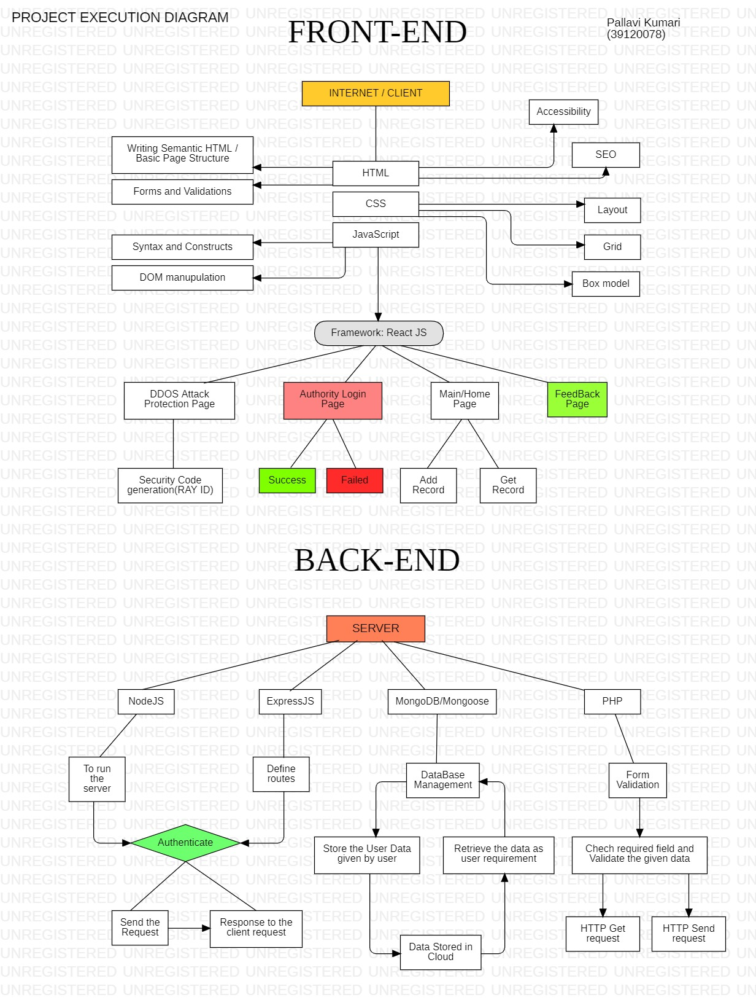

#  **Mini project for HCL Internship**

## Title: Crime record management system [CRMS]

### Introduction:
 The crime record management system project is a web based application that provides facility for the police/officials to Add the Crime Details(FIR) and get the record easily on Online platform. The system at any point of time can provide the details of FIR document, existing charge sheets and their statuses. A database system in which police will keep the record of criminals who have been arrested. This platform will also provide the total count of crime record yearly, and will give the information about how many cases has been solved and how many are still pending.

#

### Features:
 1. Admin can add the new record/FIR
 2. Admin can get the details of criminals with their all the details.
 3. Admin can edit and delete the existing record if require
 4. User will be able to get the crime count in specific time and field.
 5. No one can access or edit confidential record of criminals without successful login.
 6. Input data will be validated using JavaScript and PHP.

#

### Technology Used:
 * HTML
 * CSS
 * bootstrap
 * Vanilla JavaScript
 * NodeJS
 * ExpressJS
 * ReactJS
 * MongoDB/Mongoose(DATABASE)
 

#

### Tools Used:
 * Atom Editor
 * VS Code
 * Web Browser
 * Git and GitHub
 * Star UML
 * Hyper

#

### Scope:
 It can be used to record paper less criminal’s record and investigation. This project is mainly useful for adding and getting criminal’s record with the all the important documents related to the specific criminal easily and faster with crime ID or with criminal’s name.  The authority can preserve records of the criminals and search for any criminal using the system. This is an online web application with a database system in which police will keep the record of criminals who have been arrested or has got complaint against them.   Used HTML, JavaScript, CSS, PHP, MongoDB and Bootstrap to develop this system. The project's interface is very user-friendly and helpful for authority.

#

### Project execution work flow diagram

