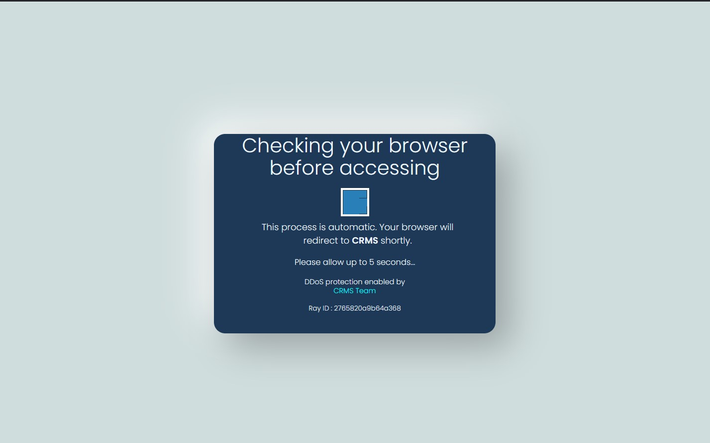
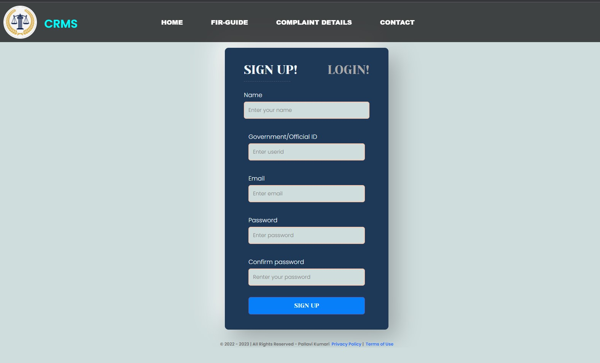
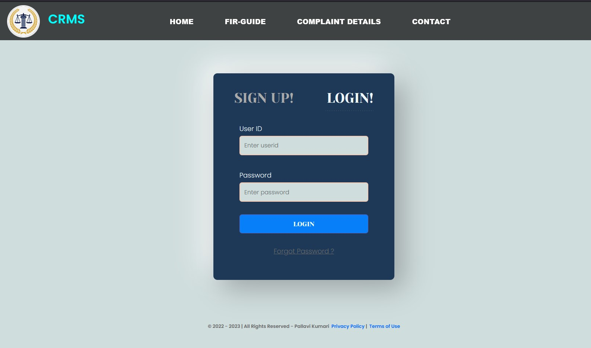
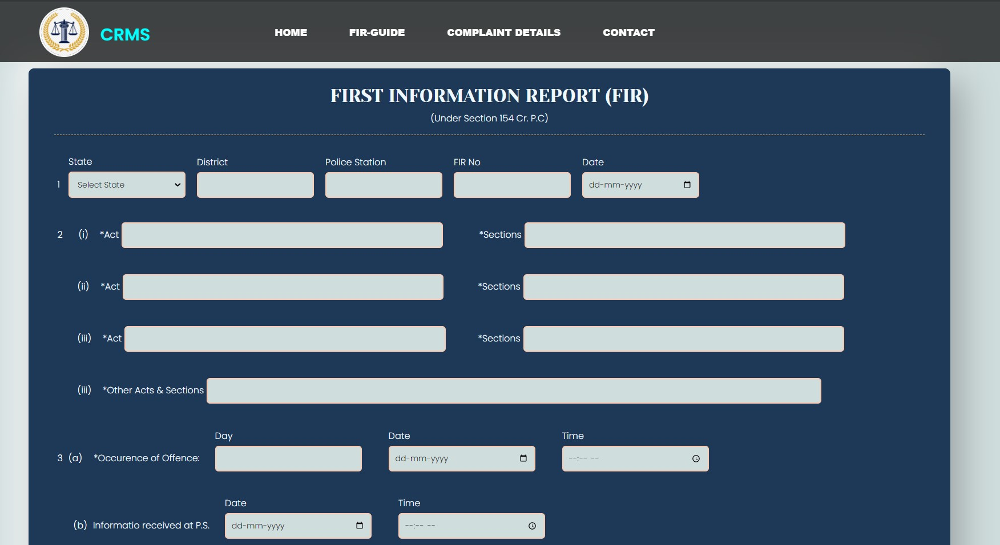
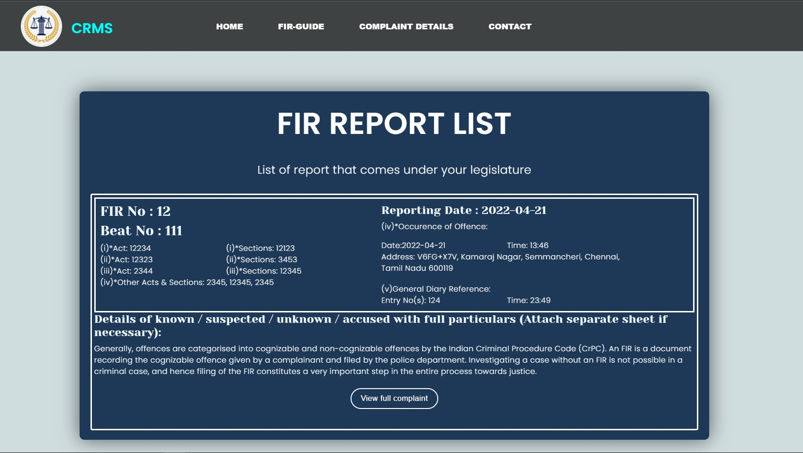

  

<h1 align="center"> E-FIR PORTAL </h1>

## This project is a Crime record management system (CRMS).

#### CRMS-Portal aims at creating a comprehensive and integrated system for enhancing the efficiency and effective policing especially at the Police Station level through adoption of technology.

#### It can be used to record paper less criminal’s record and investigation. This project is mainly useful for adding and getting criminal’s record with the all the important documents related to the specific criminal easily and faster with crime ID or with criminal’s name.

# PROGRESS TABLE

| WEB PAGE HIERARCHY                       | HTML + CSS | PORTED IN REACT | BETA BUILD | PRODUCTION BUILD |
|------------------------------------------|:------------:|:-----------------:|:------------:|:----------:|
| DDoS attack check                        |     ✅     |       ✅       |     ✅    |        ✅        |
| Sign-up page                             |     ✅     |       ✅       |     ✅    |        ✅        |
| Log-in page                              |     ✅     |       ✅       |     ✅    |        ✅        |
| Home page/the FIR reporting form         |     ✅     |       ✅       |     ✅    |        ✅        |
| Past Reported FIR Overview               |     ✅     |       ✅       |     ✅    |        ✅        |
| FIR Form Filling Guide(FAQ)              |     ✅     |       ✅       |     ✅    |        ✅        |
| Navbar                                   |     ✅     |       ✅       |     ✅    |        ✅        |

## App component Screenshots

### DDos Protection Page

### Admin Sign Up Page

### Portal Login Page

### E-FIR Reporting Page

### FIR Report List Page

## View the Project Ideation Map below 👇

#### <h6> Click Here:- https://github.com/Pallavikumarimdb/HCL-CRMS/blob/main/IdeationMap.md<h6>
